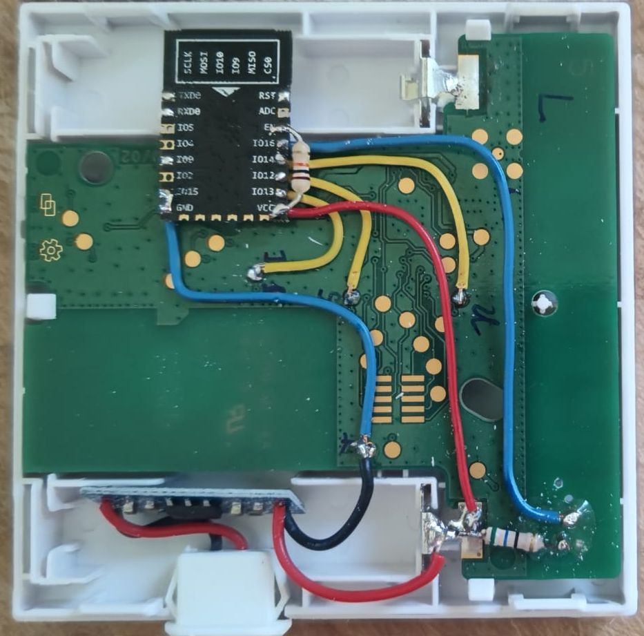
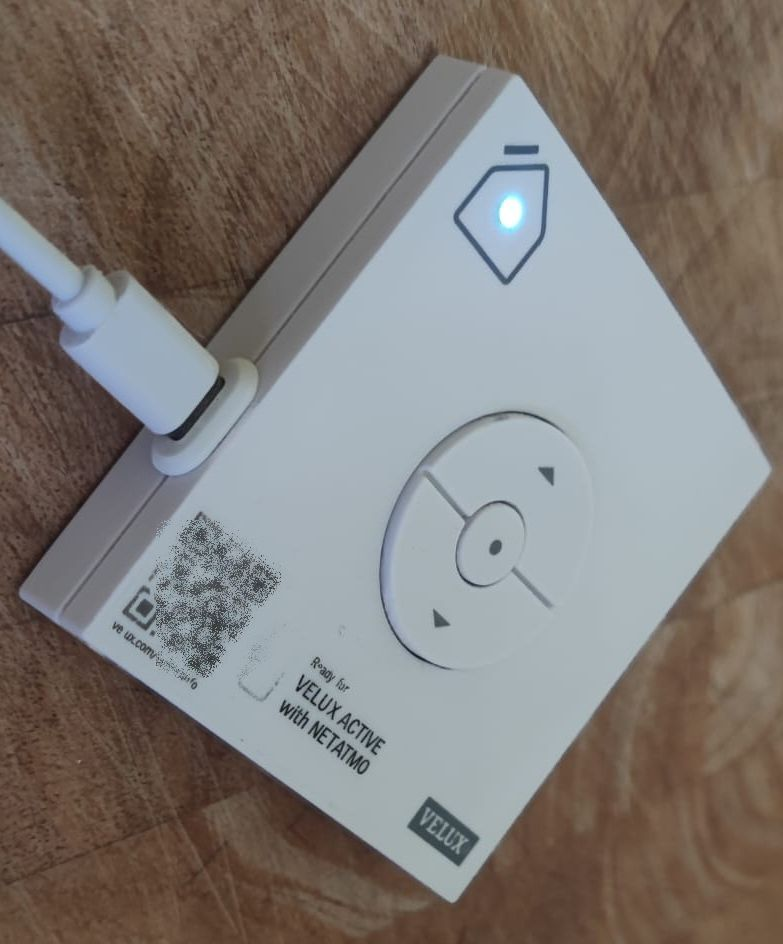

# VELUX Remote Control

This project provides a solution to control VELUX solar roller shutters via homee smart home system. It should be easily adaptable to other roller shutter products, also from other supplieres.
It is using an ESP8266 microcontroller modules and provieds a web-based interface for configuration.

## Features

- **WiFi Configuration**: Easily configure WiFi credentials and network settings via a web interface.
- **Homee Integration**: Seamlessly integrates with the homee smart home system to control roller shutters.
- **LED Status Indication**: Provides visual feedback using an onboard LED.
- **Manual Control**: KLI 310 remains functional for manual usage

## Hardware Requirements

- **ESP8266 ESP12F**: Microcontroller for running the firmware.
- **VELUX KLI 310**: Roller shutter control unit.
- **Additional Components**:
  - Resistors: 10 kOhm
  - AM1117 3.3V Voltage Regulator Module
  - USB-C Female Connector
  - LED for status indication + Resistor for 5mA @ 3.3V

## Software Requirements

- **PlatformIO**: Development environment for building and uploading the firmware.
- **Arduino Framework**: Used for programming the ESP8266.

## Limitation and known issues
- **WiFi / network** no DHCP, only fix IP address supported
- **OTA Updates** implemented but does not work
- **Openess** requires homee smart home system

## Manual

The firmware supports two modes:

1. **Configuration Mode**: 
   - Activated by pressing the STOP button during startup or if no valid configuration is found.
   - Creates a WiFi Access Point (SSID: `vhih`, Password: `12345678`) for configuration.
   - Accessible via the IP address `192.168.42.1`.

   The web interface allows you to:
   - Configure WiFi credentials and network settings.
   - Set Homee node name and ID.
   - Perform firmware updates.
   - Restart the device.

2. **Control Mode**:
   - Activated after successful configuration.
   - Connects to the configured WiFi network and integrates with Homee.

## Homee Integration

The firmware uses the `virtualHomee` library to create a virtual Homee node. It supports the following attributes:

- **Shutter Control**: Open, close, or stop the roller shutters.
- **Firmware Version**: Displays the current firmware version.

## How to Build and Upload

1. Install [PlatformIO](https://platformio.org/).
2. Clone this repository.
3. Open the project in PlatformIO.
4. Build and upload the firmware to your ESP8266.

## Library Dependencies

- [ESPAsyncWebServer](https://github.com/me-no-dev/ESPAsyncWebServer)
- [ESPAsyncTCP](https://github.com/me-no-dev/ESPAsyncTCP)
- [ArduinoOTA](https://github.com/esp8266/Arduino/tree/master/libraries/ArduinoOTA)
- [Homee API for ESP32](https://github.com/Oxi75/homee-api-esp32)

## Notes

This project uses the [Homee API for ESP32/ESP8266 from Daniel Koop](https://github.com/DanielKnoop/homee-api-esp32). Many thanks to him!

I am not affiliated with **homee GmbH**, **codeatelier GmbH** or the **VELUX group**

## License

This project is licensed under the MIT License. See the [LICENSE](LICENSE) file for details.

## Appendix A - Images

### Hardware

